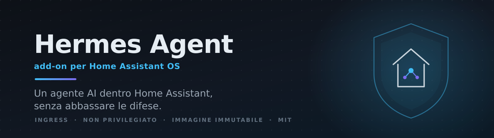
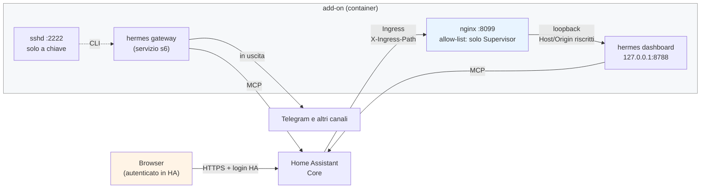

<div align="center">



Add-on per Home Assistant OS che esegue
[Hermes Agent](https://github.com/NousResearch/hermes-agent) con la sua
dashboard nativa come pannello nella sidebar (Ingress) e una CLI via SSH.

[](https://www.home-assistant.io/addons/)
[](hermes_agent/build.yaml)
[](hermes_agent/config.yaml)
[](CLAUDE.md)
[](hermes_agent/Dockerfile)
[](https://github.com/NousResearch/hermes-agent)
[](LICENSE)
[](SECURITY.md)

</div>

---

L'obiettivo è far convivere un agente AI con i canoni di sicurezza di Home
Assistant invece di aggirarli: **Ingress** come unico ingresso, **processo
non privilegiato**, **immagine immutabile** costruita in locale, **nessuna
installazione di pacchetti a runtime**, token nell'ambiente e non nei file di
configurazione.

Provato su Raspberry Pi 5 (aarch64) con HA OS. Il manifest dichiara anche
`amd64`, non verificato sul campo.

> [!IMPORTANT]
> **I default di questo repo sono quelli di un'istanza a uso personale, non
> i più prudenti possibili.** Sono scelte deliberate, documentate una per
> una in [`SECURITY.md`](SECURITY.md). Le due che contano di più:
>
> - **La dashboard non ha una password propria**: l'unica barriera è il
>   login di Home Assistant. Chiunque abbia un account su quell'istanza —
>   *anche non amministratore* — arriva a una shell nel container, al token
>   di Home Assistant e alle chiavi API dei provider configurati.
> - **SSH viene pubblicato sulla rete locale** (porta 2222) quando
>   aggiungi una chiave; per spegnerlo basta non aggiungerne nessuna.
>
> Su un'istanza condivisa valuta prima la separazione degli account.
> **Leggi [`SECURITY.md`](SECURITY.md) prima di installare.**

## Cosa fa

- **Pannello nella sidebar**: la dashboard di Hermes dentro Home Assistant,
  dietro la sua autenticazione, senza esporre porte sulla rete locale.
- **Canali di messaggistica**: Telegram e gli altri gateway supportati da
  Hermes, con un bot per profilo.
- **Profili multipli**: istanze separate di Hermes (memoria, skill, cron e
  bot propri) servite da un solo processo gateway.
- **Accesso a Home Assistant** tramite il server MCP di Core: di default
  solo le entità esposte ad Assist, in sola modalità intent.
- **CLI via SSH**, solo a chiave, come utente non privilegiato.

## Come funziona

Un solo ingresso, e tutto il resto in ascolto solo su loopback:



Cosa garantisce questo schema:

| Canone | Come è rispettato |
|---|---|
| Ingress come unico ingresso | la dashboard ascolta solo su `127.0.0.1`; nginx accetta solo il Supervisor |
| Processo non privilegiato | agent, dashboard, gateway e sessioni SSH girano come uid 1000, mai root |
| Immagine immutabile | build locale dal `Dockerfile`, nessuna chiave `image:`, nessun `curl \| sh` |
| Nessun install a runtime | `allow_lazy_installs: false`; i provider si aggiungono con un extra e un rebuild |
| Segreti fuori dai config | il token di HA è interpolato da `.env`, mai scritto nei file di configurazione |

## Installazione

### Da questo repository (consigliato)

1. In Home Assistant: **Impostazioni → Add-on → Store**.
2. Menù **⋮** in alto a destra → **Repository**.
3. Incolla l'indirizzo di questo repository e premi **Aggiungi**:
   ```
   https://github.com/savez/hermes-agent-addon-ha
   ```
4. Chiudi la finestra: "Hermes Agent" compare nello Store. Aprilo e
   **installa**.
5. Configura le opzioni e avvia.

Gli aggiornamenti arrivano come per qualunque altro add-on: quando qui viene
pubblicata una versione nuova, Home Assistant la propone (⋮ → **Controlla
aggiornamenti** se vuoi forzare il controllo).

### Copiando la cartella (per sviluppo)

Utile se stai modificando l'add-on: copia `hermes_agent/` in `/addons` sul
dispositivo (via Samba, SSH o l'add-on "Studio Code Server"), poi ⋮ →
**Controlla aggiornamenti**. Comparirà sotto "Local add-ons".

> [!NOTE]
> In entrambi i casi **non viene scaricata nessuna immagine precompilata**:
> il manifest non ha la chiave `image:`, quindi il Supervisor costruisce
> l'immagine sul dispositivo dal `Dockerfile`. La prima build richiede
> diversi minuti su un Raspberry Pi.

Configurazione, opzioni disponibili, accesso SSH e risoluzione dei problemi:
[`hermes_agent/DOCS.md`](hermes_agent/DOCS.md).

## Struttura del repo

```
hermes_agent/            # l'add-on (lo slug con cui appare nello Store)
  Dockerfile             # build: clona l'ultimo tag di release di hermes-agent
  config.yaml            # manifest: opzioni, Ingress, rete, permessi
  build.yaml             # immagine base per architettura
  DOCS.md                # documentazione utente (mostrata anche dentro HA)
  CHANGELOG.md           # storia delle correzioni, con la causa di ognuna
  patches/               # patch applicate al frontend in fase di build
  translations/          # it.yaml (nativo) + en.yaml
  rootfs/                # file copiati nell'immagine
    etc/s6-overlay/      # servizi: init-hermes, main-hermes, dashboard, nginx, sshd
    etc/nginx/           # reverse proxy Ingress -> dashboard su loopback
    etc/ssh/             # sshd: solo chiave, solo utente hermes
    usr/local/bin/hermes # wrapper CLI che scende sempre a uid 1000
    usr/local/lib/hermes-ha/render_config.py   # applica i vincoli al config di Hermes

  icon.png / logo.png    # immagini mostrate nello Store di Home Assistant

repository.yaml          # rende il repo aggiungibile come repository di add-on
tests/                   # test di render_config.py
tools/hermes-ssh         # helper lato client per CLI e tunnel
CLAUDE.md                # contratto di progetto: le regole e il perché
SECURITY.md              # modello di sicurezza e compromessi dichiarati
```

## Sviluppo

Le regole in [`CLAUDE.md`](CLAUDE.md) vanno rispettate anche quando sembrano
semplificabili: ognuna chiude un problema concreto, quasi sempre uno scontro
fra le assunzioni di Hermes Agent (pensato per la postazione di uno
sviluppatore) e i vincoli di Home Assistant. Il `CHANGELOG` documenta la
causa di ogni correzione, non solo cosa è cambiato: leggerlo prima di
rimettere mano a nginx, ai servizi s6 o al build fa risparmiare tempo.

Test statici:

```bash
python -m pytest tests/
shellcheck hermes_agent/rootfs/etc/s6-overlay/scripts/init-hermes.sh
hadolint hermes_agent/Dockerfile
```

Build locale (richiede QEMU per aarch64 su una macchina x86):

```bash
docker build --platform linux/arm64 -t hermes-ha:test hermes_agent/
```

## Contribuire

Segnalazioni e pull request sono benvenute: leggi
[`CONTRIBUTING.md`](CONTRIBUTING.md), che spiega le verifiche locali e le
modifiche che richiedono attenzione particolare. Per vulnerabilità
sfruttabili non aprire una issue pubblica: vedi [`SECURITY.md`](SECURITY.md).

## Licenza e crediti

Questo repo contiene soltanto l'integrazione con Home Assistant. Hermes Agent
è un progetto di [NousResearch](https://github.com/NousResearch/hermes-agent)
e mantiene la propria licenza: qui non ne è incluso il codice, viene clonato
in fase di build.

Licenza di questo add-on: vedi [`LICENSE`](LICENSE).
